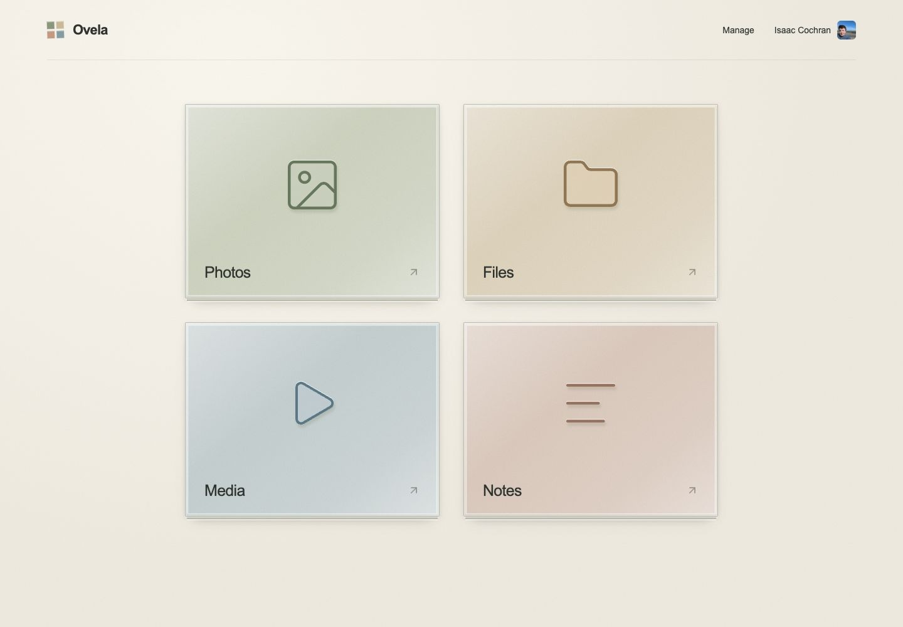
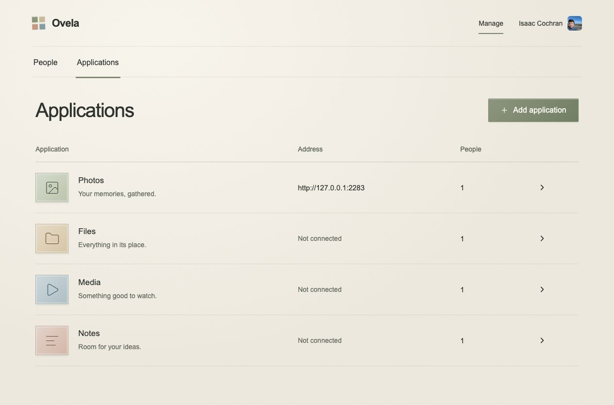
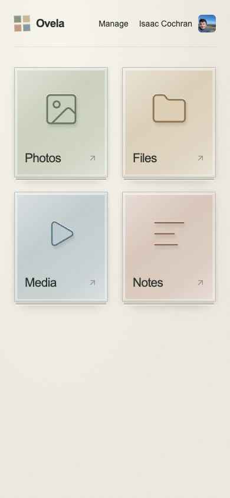

<h1 align="center">Ovela</h1>

<p align="center">A self-hosted home for your apps.</p>

<p align="center">
  <a href="#quick-start">Quick start</a> ·
  <a href="#screenshots">Screenshots</a> ·
  <a href="docs/self-hosting.md">Self-hosting guide</a> ·
  <a href="LICENSE">MIT license</a>
</p>



Ovela brings your applications into one home, with a shared sign-in for the bundled Immich photo library. Invite people, choose which apps appear in their home, and manage your catalog without a rebuild. Run the stack on your own hardware with Docker Compose. No hosted service accounts are required.

Warm stone surfaces, glass tiles, and short watercolor transitions carry through the home and management screens. Built with Next.js, Convex, and Better Auth.

## Quick start

Requires Docker with Compose v2.20+ and OpenSSL. Allow at least 8 GB RAM for the combined Ovela and Immich stack. No hosted service accounts are required.

```sh
git clone https://github.com/NotAKerbal/ovela.git
cd ovela
./ovela up
./ovela setup
```

Open the private setup link printed by the second command and create your first administrator account. The default app address is `http://127.0.0.1:3000`. The first build downloads dependencies and container images. Subsequent starts reuse them.

The stack runs Next.js, the Convex backend, Immich, and Collabora in Docker. Photos opens the bundled Immich library with Ovela sign-in; see [Immich setup and storage](docs/immich.md). An existing Pelican panel can optionally use Ovela sign-in; see [Pelican setup](docs/pelican.md). Better Auth runs inside Convex. Database and file data persist in a Docker volume; secrets remain in the ignored, owner-readable `.env.selfhost` file. See [self-hosting](docs/self-hosting.md) for domain configuration, backups, upgrades, and alternate ports.

## Features

- First-administrator setup with a private setup key.
- Email/password sign-in, password changes, and local profile photos.
- Shared Ovela sign-in for the bundled Immich photo library.
- Ovela Photos web theme with desktop sidebar, mobile bottom navigation, and three-column mobile photos.
- People and application management using the approved visual designs.
- Copyable, email-bound invitations that expire after seven days. Reissuing or revoking a link invalidates it.
- Member/Admin roles, per-person app visibility, suspension, and last-active-admin protection.
- A live application catalog; changes appear in the home without a rebuild.
- Keyboard access, responsive layouts, loading skeletons, and reduced-motion support.

Invitations are copied and shared manually; Ovela does not send email. Photos connects to bundled Immich with shared Ovela sign-in. Files opens the bundled workspace. Media and Notes have no destination until configured. Photos grants are checked when signing into Immich; existing Immich sessions remain valid until they expire or are revoked in Immich. For unrelated applications, grants control launcher visibility only.

## Screenshots

Captured from a running self-hosted installation. Photos is connected to Immich; Files opens the bundled workspace.

<table>
  <tr>
    <th>Application management</th>
    <th>Mobile home</th>
  </tr>
  <tr>
    <td width="76%" valign="top"><a href="docs/screenshots/applications.png"></a></td>
    <td width="24%" valign="top"><a href="docs/screenshots/home-mobile.png"></a></td>
  </tr>
</table>

Open a screenshot to view it at full size. See the [capture notes](docs/screenshots/README.md) to refresh these images.

## Develop

Use Node.js 24 and npm. With the self-hosted stack running, configure the local CLI to target it using `CONVEX_SELF_HOSTED_URL` and `CONVEX_SELF_HOSTED_ADMIN_KEY` in an ignored `.env.local`, alongside the public Convex URLs. Never commit that key.

```sh
npm ci
npm run dev:backend
# In another terminal; stop the Docker app first if both use port 3000.
npm run dev:web
```

For development without Docker, `CONVEX_AGENT_MODE=anonymous npx convex init` creates a local development backend without a Convex account. Keep `npx convex dev` running, and configure its `SITE_URL`, `BETTER_AUTH_SECRET`, `OVELA_SETUP_TOKEN`, and `OVELA_INTERNAL_CONVEX_SITE_URL` before creating accounts. For the usual native local backend, set the internal site URL to `http://127.0.0.1:3211`. This is a development alternative; `./ovela up` is the packaged self-hosting path.

```sh
npm test
npm run typecheck
npm run build
```

The focused backend tests exercise real Convex component data, session validation, role boundaries, invitation revocation and replacement races, and last-admin protection. The production Next.js build uses standalone output.

## Source map

- `components/haven.tsx`: app tiles and bounded pigment transitions.
- `components/management.tsx`: people, invitations, app access, and application editing.
- `convex/management.ts`: permission-checked queries and mutations.
- `convex/auth.ts` and `convex/betterAuth/`: Better Auth integration and atomic enrollment.
- `design/`: original image studies, prompts, and naming exploration. Historical images use the working name Mosaic Haven; the selected name is Ovela.

The prototype originally had a standalone hosted visual demo. Ovela's current implementation and startup flow are fully self-hosted and do not depend on that demo or its hosting provider.

## License

Ovela is [MIT licensed](LICENSE). Bundled services retain their own licenses; Immich and the Ovela Photos web overrides are AGPLv3; see [Ovela Photos](immich/README.md) for source and build details.

## Files

Shareable links work without an Ovela account. The owner chooses view/download or editing access, optional password protection, and an expiry. Links can be revoked from the Share dialog. Editing links support existing text and office documents; they do not allow uploads, deletion, moving, or permission changes.

Open Files from the home page. Each person has a private file root and can share files or folders with other Files users as viewers or editors. The workspace includes uploads, folders, rename/move, trash with Undo, media/PDF previews, a CodeMirror code editor, Markdown live preview, and embedded Collabora office editing. The folder sidebar supports resizing, dragging closed, a toggle button, and Cmd/Ctrl+B outside text editors.

`./ovela up` starts the complete local package. Office uses port 9980 by default; see [Office setup](docs/files-office.md) for remote domains and the home-mode limits. File bytes and saved revisions persist in `files_data`; metadata, sharing, and sessions are in the Convex volume. Back up **both volumes together** along with `.env.selfhost`.

Current limits: uploads are capped at 100 MiB and are not resumable; text editing is capped at 2 MiB. Videos use native browser playback, with no transcoding. Saved revisions are retained, but a version-restore UI, trash browser, and orphan-blob cleanup are not included yet. Immich library browsing inside Files is deferred.
